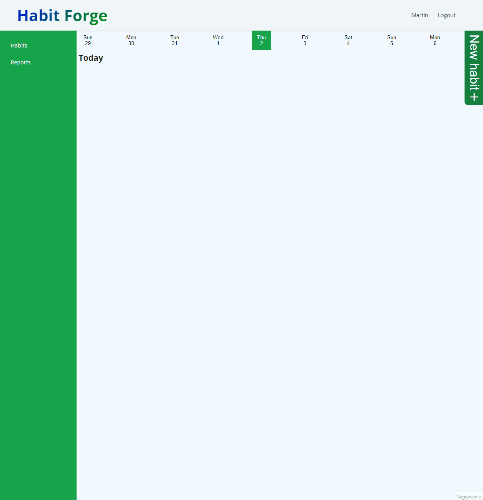

# Habit Tracker University
## Starting the project as development server
### Backend
> **Please note** that all commands and files path are relative to `backend/` folder
1. Steps for cloned project
    1. Run `composer install`
    2. Copy `.env.example` file into `.env` file and fill it with setup for your configuration
    3. Run `php artisan key:generate`
    4. Run `php artisan migrate`
2. Steps for copied project
    1. Project is configured for SQLite and database is already here, in file `database/database.sqlite`
    2. Credentials for user with existing habits: `admin@mail.com` & `adminhaslo!`
    3. For database inspection run `sqlite database/database.sqlite`. This command will start sqlite interpreter where database can be edited and viewed with SQL. `.headers ON` makes `SELECT` more readable
3. Run `php artisan serve`
4. Website can be accessed on http://localhost:8000/
### Frontend
> **Please note** that all commands and files path are relative to `frontend/` folder
1. Steps for cloned project
    1. Run `npm i`
    2. Copy `.env.example` file into `.env` file and fill link to backend
2. Run `npm run dev`
3. Website can be accessed on http://localhost:4000/

## Features
- User authentication with extensive validation and interface that displays problems
- Responsive SPA website that doesn't need to reload
- Each user can create, update and delete his habits with sliding form
- Created habits can be marked as `done` or `failed`, when there is no mark in database it defaults to `undefined` state
- User can see and change habit marks for different days with day picker

## Showcase
> These pictures are GIFs, if they don't play check README.md file
### Validation

### Overview

### CRUD

---
### Used technologies
[][php]
[][laravel]
[][sqlite]
[][js]
[][react]
[][css]
[][vite]

[js]: https://en.wikipedia.org/wiki/JavaScript
[react]: https://pl.reactjs.org
[vite]: https://vitejs.dev
[php]: https://www.php.net
[laravel]: https://laravel.com
[sqlite]: https://www.sqlite.org/index.html
[js]: https://en.wikipedia.org/wiki/JavaScript
[react]: https://pl.reactjs.org
[css]: https://en.wikipedia.org/wiki/CSS
[vite]: https://vitejs.dev